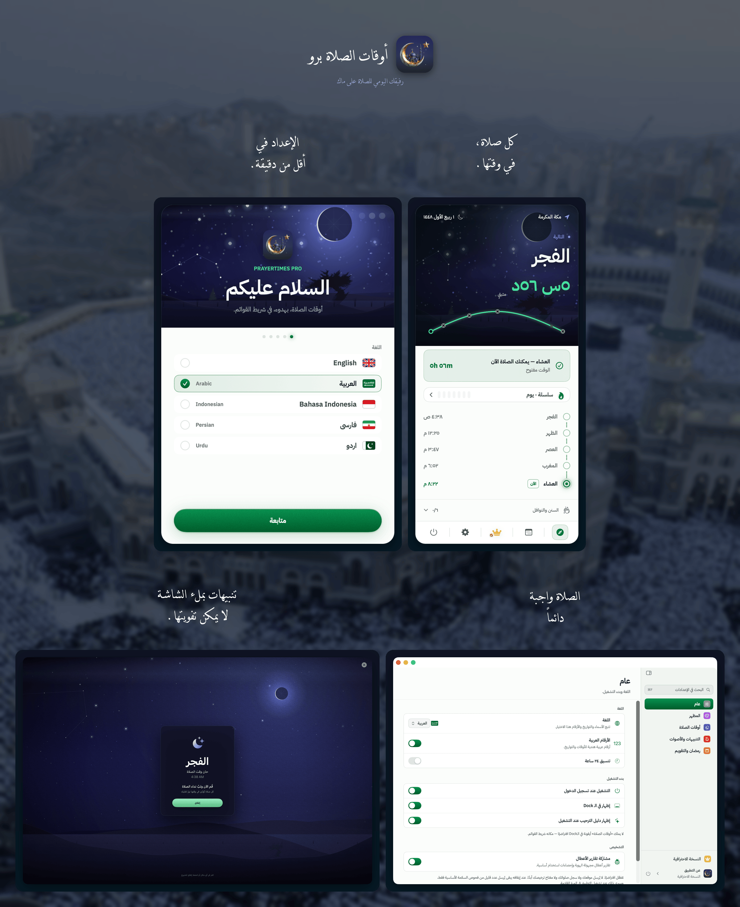

<!-- BEGIN abd3lraouf-studios:hero -->

    <a href="README.md">English</a> | <strong>العربية</strong> | <a href="README.fa.md">فارسی</a> | <a href="README.id.md">Bahasa Indonesia</a> | <a href="README.ur.md">اردو</a>

    

<h1 align="center">أوقات الصلاة برو</h1>

    <strong>تطبيق بسيط وخاص بالكامل لأوقات الصلاة الإسلامية يعيش في شريط القوائم على جهاز ماك.</strong> 
    حساب أوقات الصلاة دون اتصال · 26 طريقة · 5 لغات · يدعم Apple Silicon و Intel

    

    <a href="https://abd3lraouf.dev/projects/prayertimes/">abd3lraouf.dev/projects/prayertimes/</a>

<!-- END abd3lraouf-studios:hero -->

    
    

    
    
    
    

    

---

## لماذا أوقات الصلاة برو؟

- **خاص افتراضيًا** — بلا حسابات، ولا شيء يتعقّبك عبر التطبيقات أو الويب. تُحسب أوقات الصلاة على جهازك، ولا يُرسَل موقعك الدقيق أبدًا. ويمكن إيقاف التشخيصات المجهولة من الإعدادات ← عام ← التشخيص.
- **مصمم لشريط القوائم** — مرئي دائمًا، ولا يزعجك أبدًا. عرض عدّ تنازلي أو وقت محدّد أو مختصر أو أيقونة فقط.
- **دقيق في كل العالم** — 26 طريقة حساب، تعديلات لكل صلاة، زوايا مخصصة.
- **يعمل دون اتصال** — تتم الحسابات على الجهاز نفسه. تُستخدم الشبكة فقط للبحث الاختياري عن الموقع.

## التثبيت

**المتطلبات:** macOS 14 (Sonoma) أو أحدث · يدعم Apple Silicon و Intel

يُوزَّع أوقات الصلاة برو حصريًا عبر ماك آب ستور.

## المزايا

- **عدّ تنازلي** في شريط القوائم، أو الوقت المحدّد، أو عرض مختصر، أو أيقونة فقط
- **إشعارات** قبل الصلاة وعند دخول وقتها، مع إمكانية التنبيه على كامل الشاشة
- **26 طريقة حساب**: رابطة العالم الإسلامي (MWL)، الجمعية الإسلامية لأمريكا الشمالية (ISNA)، الهيئة العامة المصرية، أم القرى (مكة المكرمة)، الديانة (تركيا)، كمناغ (إندونيسيا)، كراتشي، طهران، دبي، قطر، سنغافورة، الكويت، الجزائر، فرنسا، ألمانيا، ماليزيا (JAKIM)، وغيرها
- **تحديد الموقع تلقائيًا أو يدويًا** · تعديلات وقت لكل صلاة لمطابقة مسجدك المحلي
- **التقويم الهجري** بإمكانية ضبط التاريخ وإشعارات بالأحداث الإسلامية (رمضان، عيد الفطر، عيد الأضحى، رأس السنة الهجرية، يوم عاشوراء، وغيرها)
- **وضع رمضان**: إشعارات السحور والإفطار مع تنبيهات مسبقة
- **سجل الصلوات** — علّم كل صلاة عند أدائها، مع بداية يوم مرتبطة بالفجر، وسلاسل مواظبة، وتتبّع للقضاء
- **السنن والنوافل** إلى جانب الفرائض الخمس
- **بوصلة القبلة** تشير إلى الكعبة من حيث كنت
- **مكتبة الأذان** — تسجيلات من 28 دولة، مع أذان منفصل للفجر، وساعات هدوء، وإعدادات تأجيل، وإعلانات لكل صلاة
- **إعدادات تجد نفسها** — نافذة بقائمة جانبية وبحث يشمل كل الأقسام
- **أرقام محلية** (هندية عربية، هندية عربية ممتدة، غربية)
- **5 لغات**: English، العربية، Bahasa Indonesia، فارسی، اردو — مع دعم كامل لاتجاه RTL
- **الوضع الفاتح/الداكن** يتبع نظامك تلقائيًا، مع إمكانية تجاوز المظهر واختيار لون التمييز
- **إتاحة الوصول** — دعم Dynamic Type وزيادة التباين وتقليل الحركة في التطبيق كله

## مجاني وبرو

تنزيل أوقات الصلاة برو مجاني، وجوهر التطبيق يبقى مجانيًا دائمًا: العدّ التنازلي في شريط القوائم، وطرق الحساب الست والعشرين كلها، وتعديلات كل صلاة، والإشعارات والتنبيهات على كامل الشاشة، والتقويم الهجري وتذكيراته بالمناسبات، ووضع رمضان، وبوصلة القبلة، والسماء المتحركة، والمظهرين الفاتح والداكن. هذا تطبيق أوقات صلاة متكامل، ولا يكلّفك شيئًا.

ويضيف **فتح برو لمرة واحدة مقابل 4.99 دولارًا** مكتبة الأذان الكاملة — مؤذنون إضافيون وأذان فجر منفصل والتحكم بمستوى الصوت — والتنبيهات المنطوقة قبل الصلاة، وسجل الصلوات بسلاسل المواظبة وتتبّع القضاء، وقوس مسار الشمس ومدفع رمضان، واختصار Siri «الصلاة القادمة»، وخمسة ألوان تمييز إضافية. دفعة واحدة، بلا اشتراك وبلا حساب.

## الخصوصية

لا إعلانات، ولا حسابات، ولا شيء يتعقّبك عبر التطبيقات أو الويب. تُحسب أوقات الصلاة بالكامل على جهازك، ولا يُرسَل موقعك **الدقيق** أبدًا. وما يخرج فعلًا من جهازك: إحصاءات استخدام مجهولة الهوية من النسختين، وتقارير أعطال مجهولة الهوية من التنزيل المباشر — ولا يشمل ذلك أبدًا موقعك ولا سجل صلواتك ولا مفتاح ترخيصك، ويمكن إيقافه كله بنقرة واحدة من الإعدادات ← عام ← التشخيص.

لعرض اسم المدينة بدل الإحداثيات، يُقرَّب موقعك إلى نحو 1.1 كم ويُطلب الاسم من خدمة تحديد المواقع لدى Apple. أما إرسال هذا الموقع المقرَّب إلى **OpenStreetMap Nominatim** — وهو ما تحتاجه الإندونيسية والفارسية والأردية للحصول على اسم مكتوب بشكل صحيح — فهو **معطَّل افتراضيًا** ويمكن تفعيله من «أوقات الصلاة ← الموقع». وعند كتابة اسم مدينة في منتقي الموقع يُرسَل النص الذي تكتبه فقط. تُنزَّل مقاطع أذان برو عند الطلب من Internet Archive. وتصل التحديثات عبر آب ستور حصرًا.

## ماذا يمكنك أن تفعل هنا

- 🐛 [**القضايا**](https://github.com/abd3lraouf-studios/PrayerTimes/issues) — أبلغ عن خطأ أو اطلب ميزة، أو [أنشئ قضية جديدة](https://github.com/abd3lraouf-studios/PrayerTimes/issues/new/choose).
- 💬 [**النقاشات**](https://github.com/abd3lraouf-studios/PrayerTimes/discussions) — اطرح الأسئلة، شارك الأفكار، وتحدّث مع المستخدمين.
- 📚 [**الويكي**](https://github.com/abd3lraouf-studios/PrayerTimes/wiki) — أدلّة، أسئلة شائعة، ومعرفة مشتركة.

إذا واجهتك مشكلة أو لديك طلب، ابحث أولًا في [القضايا](https://github.com/abd3lraouf-studios/PrayerTimes/issues)، ثم [أنشئ قضية جديدة](https://github.com/abd3lraouf-studios/PrayerTimes/issues/new/choose). للنقاشات العامة، توجّه إلى [النقاشات](https://github.com/abd3lraouf-studios/PrayerTimes/discussions).

## ادعم التطوير

أوقات الصلاة برو مبني ومُصان على يد مطوّر واحد في وقت فراغه. إذا كان مفيدًا لك، ندعوك لدعم التطوير:

    
    
    

كلّ مساهمة — مهما كانت صغيرة — تساعد في إبقاء التطبيق قيد التطوير النشط، وخاليًا من الإعلانات والمتعقّبات والحسابات.

## الشكر والتقدير

بُني على هذه المشاريع الرائعة:

- [Adhan](https://github.com/batoulapps/Adhan) — حساب أوقات الصلاة
- [FluidMenuBarExtra](https://github.com/lfroms/fluid-menu-bar-extra) — واجهة شريط القوائم
- [NavigationStack](https://github.com/indieSoftware/NavigationStack) — التنقّل
- مستلهَم من [سجدة](https://github.com/ikoshura/Sajda)

## الترخيص

أوقات الصلاة برو **مغلق المصدر**. يستضيف هذا المستودع القضايا والنقاشات والمواد الصحفية فقط. يُوزَّع التطبيق وفق اتفاقية ترخيص المستخدم النهائي الخاصة به — انظر [قائمة ماك آب ستور](https://apps.apple.com/eg/app/prayer-times-pro-menubar/id6763390896?mt=12).
