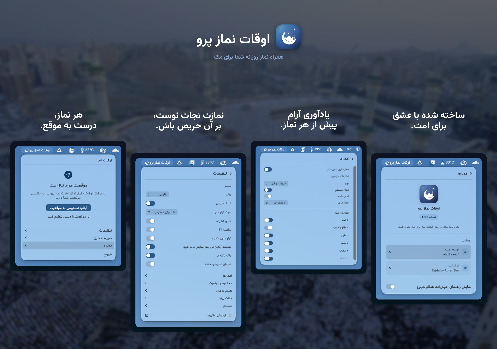

<p align="center">
    <a href="README.md">English</a> | <a href="README.ar.md">العربية</a> | <a href="README.id.md">Indonesia</a> | <strong>فارسی</strong> | <a href="README.ur.md">اردو</a>
</p>

<p align="center">
    
</p>

<h1 align="center">اوقات نماز پرو</h1>

<p align="center">
    <strong>یک برنامهٔ مینیمال و حافظ حریم خصوصی برای اوقات شرعی نماز که در نوار منوی مک شما زندگی می‌کند.</strong><br>
    محاسبهٔ آفلاین اوقات نماز · بیش از ۱۸ روش · ۵ زبان · Apple Silicon و Intel
</p>

<p align="center">
    <a href="https://apps.apple.com/eg/app/prayer-times-pro-menubar/id6763390896?mt=12">
        
    </a>
</p>

<p align="center">
    <a href="https://github.com/App-Builders-Gang/PrayerTimes/releases/latest"></a>
    <a href="https://github.com/App-Builders-Gang/PrayerTimes/releases/latest"></a>
    <a href="https://github.com/App-Builders-Gang/PrayerTimes/releases"></a>
    <a href="https://github.com/App-Builders-Gang/PrayerTimes/issues"></a>
    <a href="https://github.com/App-Builders-Gang/PrayerTimes/stargazers"></a>
</p>

<p align="center">
    
    
    
    
</p>

<p align="center">
    
</p>

---

## چرا اوقات نماز پرو؟

- **کاملاً خصوصی** — بدون ردیابی، بدون تحلیل، بدون حساب کاربری. اوقات نماز روی مک شما محاسبه می‌شود و موقعیت دقیق شما هرگز ارسال نمی‌شود.
- **طراحی‌شده برای نوار منو** — همیشه قابل‌مشاهده، هرگز مزاحم نیست. شمارش معکوس، زمان دقیق، فشرده، یا فقط آیکون.
- **در سراسر جهان دقیق** — بیش از ۱۸ روش محاسبه، تنظیمات جداگانه برای هر نماز، زاویه‌های سفارشی.
- **نخست-آفلاین** — محاسبات روی دستگاه انجام می‌شوند. شبکه فقط برای جست‌وجوی اختیاری موقعیت استفاده می‌شود.

## نصب

**نیازمندی‌ها:** macOS 13 (Ventura) یا بالاتر · Apple Silicon و Intel

### Mac App Store (پیشنهادی)

<a href="https://apps.apple.com/eg/app/prayer-times-pro-menubar/id6763390896?mt=12">
    
</a>

### Homebrew

```sh
brew install --cask app-builders-gang/tap/prayertimes
```

### دانلود مستقیم

آخرین فایل `.dmg` را از [انتشارها](https://github.com/App-Builders-Gang/PrayerTimes/releases/latest) دانلود کنید. نسخهٔ Developer ID امضا، تأیید شده توسط اپل (notarized) و دارای به‌روزرسانی خودکار از طریق [Sparkle](https://sparkle-project.org) است.

اگر macOS اجرا را در نخستین بار مسدود کرد:

```sh
xattr -r -d com.apple.quarantine /Applications/PrayerTimes.app
```

## امکانات

- **شمارش معکوس** در نوار منو، زمان دقیق، نمایش فشرده، یا فقط آیکون
- **اعلان‌ها** پیش از نماز و در زمان نماز، با گزینهٔ هشدار تمام‌صفحه
- **بیش از ۱۸ روش محاسبه**: اتحادیهٔ جهانی مسلمین (MWL)، ISNA، سازمان عمومی مصر، ام‌القری (مکه)، دیانت (ترکیه)، کمناغ (اندونزی)، کراچی، تهران، دبی، قطر، سنگاپور، کویت، الجزایر، فرانسه، آلمان، مالزی (JAKIM)، و موارد دیگر
- **مکان خودکار یا دستی** · تنظیم جداگانه برای هر نماز جهت تطبیق با مسجد محلی شما
- **تقویم هجری** با تاریخ قابل تنظیم و اعلان رویدادهای اسلامی (رمضان، عید فطر، عید قربان، سال نوی هجری، روز عاشورا و موارد دیگر)
- **حالت رمضان**: اعلان‌های سحری و افطار با هشدارهای پیش از موعد
- **اعداد محلی** (هندی-عربی، هندی-عربی گسترده، غربی)
- **۵ زبان**: English، العربية، Bahasa Indonesia، فارسی، اردو — با پشتیبانی کامل از RTL
- **حالت روشن/تاریک** از تنظیمات سیستم پیروی می‌کند

## حریم خصوصی

بدون ردیابی. بدون تحلیل. بدون گزارش‌گر کرش. بدون تبلیغات. بدون حساب کاربری. اوقات نماز کاملاً روی مک شما محاسبه می‌شود و موقعیت **دقیق** شما هرگز ارسال نمی‌شود.

برای نمایش نام شهر به‌جای مختصات خام، موقعیت شما به حدود ۱٫۱ کیلومتر گرد می‌شود و نام از سرویس مکان‌یابی Apple گرفته می‌شود. ارسال همین مختصات گردشده به **OpenStreetMap Nominatim** — که اندونزیایی، فارسی و اردو برای نامی درست به آن نیاز دارند — **به‌صورت پیش‌فرض خاموش است** و از تنظیمات ← محاسبه و موقعیت فعال می‌شود. هنگام تایپ نام شهر در انتخابگر موقعیت، فقط متنی که می‌نویسید ارسال می‌شود. کلیپ‌های اذان نسخهٔ Pro در صورت نیاز از Internet Archive دانلود می‌شوند و بررسی به‌روزرسانی Sparkle تنها در نسخهٔ Developer ID اجرا می‌شود. نسخهٔ Mac App Store به‌روزرسانی‌ها را منحصراً از طریق اپل دریافت می‌کند.

## این‌جا چه می‌توانید بکنید

- 🐛 [**Issues**](https://github.com/App-Builders-Gang/PrayerTimes/issues) — یک باگ گزارش کنید یا ویژگی درخواست بدهید، یا [مورد جدید بسازید](https://github.com/App-Builders-Gang/PrayerTimes/issues/new/choose).
- 💬 [**Discussions**](https://github.com/App-Builders-Gang/PrayerTimes/discussions) — سؤال بپرسید، ایده به اشتراک بگذارید و با کاربران دیگر گفت‌وگو کنید.
- 📥 [**Releases**](https://github.com/App-Builders-Gang/PrayerTimes/releases) — نسخهٔ خاصی را دانلود کنید یا تغییرات را بخوانید.
- 📚 [**Wiki**](https://github.com/App-Builders-Gang/PrayerTimes/wiki) — راهنماها، پرسش‌های متداول و دانش مشترک.

اگر مشکلی دارید یا درخواستی، ابتدا در [Issues](https://github.com/App-Builders-Gang/PrayerTimes/issues) جست‌وجو کنید، سپس [مورد جدید باز کنید](https://github.com/App-Builders-Gang/PrayerTimes/issues/new/choose). برای گفت‌وگوی عمومی به [Discussions](https://github.com/App-Builders-Gang/PrayerTimes/discussions) بروید.

## از توسعه پشتیبانی کنید

اوقات نماز پرو توسط یک توسعه‌دهنده در اوقات فراغت ساخته و نگهداری می‌شود. اگر برایتان مفید است، لطفاً پشتیبانی از توسعه را در نظر بگیرید:

<p>
    <a href="https://github.com/sponsors/abd3lraouf"></a>
    <a href="https://www.buymeacoffee.com/abd3lraouf"></a>
    <a href="https://ko-fi.com/abd3lraouf"></a>
</p>

هر کمکی — هر چقدر هم کوچک — به فعال ماندن توسعهٔ برنامه و عاری بودن آن از تبلیغات، ردیاب‌ها و حساب‌های کاربری کمک می‌کند.

## سپاسگزاری

ساخته شده روی این پروژه‌های فوق‌العاده:

- [Adhan](https://github.com/batoulapps/Adhan) — محاسبهٔ اوقات نماز
- [FluidMenuBarExtra](https://github.com/lfroms/fluid-menu-bar-extra) — رابط نوار منو
- [NavigationStack](https://github.com/indieSoftware/NavigationStack) — ناوبری
- [Sparkle](https://sparkle-project.org) — چارچوب به‌روزرسانی خودکار (نسخهٔ Developer ID)
- الهام‌گرفته از [Sajda](https://github.com/ikoshura/Sajda)

## مجوز

اوقات نماز پرو **متن‌بسته (closed source)** است. این مخزن فقط میزبان آرتیفکت‌های انتشار عمومی، Issues و Discussions است. برنامه تحت توافق‌نامهٔ مجوز کاربر نهایی خود توزیع می‌شود — به [فهرست Mac App Store](https://apps.apple.com/eg/app/prayer-times-pro-menubar/id6763390896?mt=12) مراجعه کنید.
