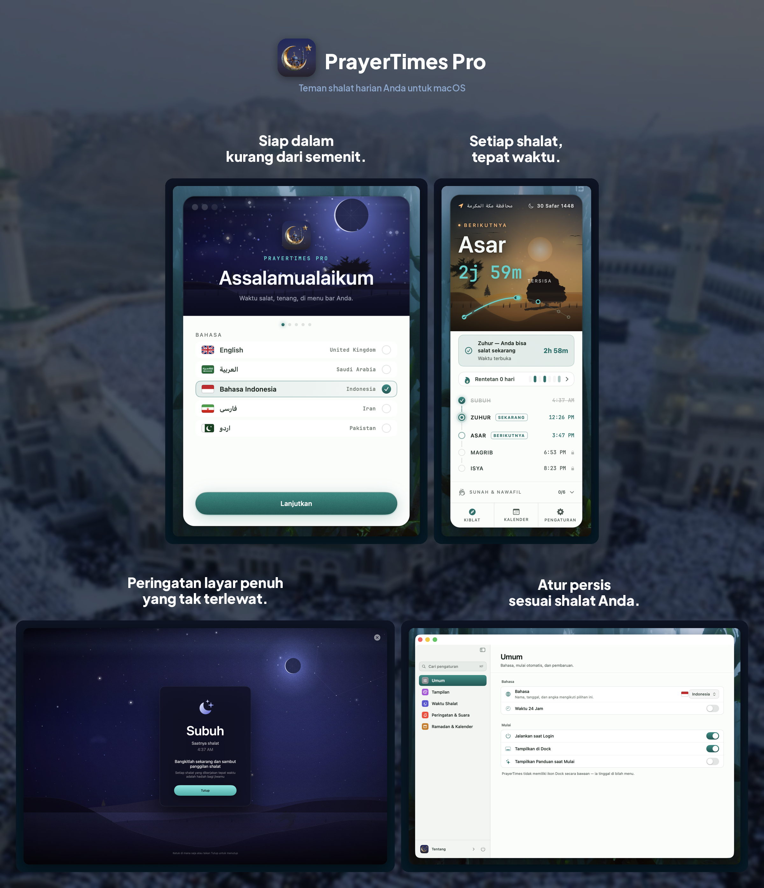

<p align="center">
    <a href="README.md">English</a> | <a href="README.ar.md">العربية</a> | <strong>Indonesia</strong> | <a href="README.fa.md">فارسی</a> | <a href="README.ur.md">اردو</a>
</p>

<p align="center">
    
</p>

<h1 align="center">PrayerTimes Pro</h1>

<p align="center">
    <strong>Aplikasi waktu shalat minimalis yang mengutamakan privasi, tinggal di menu bar Mac Anda.</strong><br>
    Perhitungan waktu salat offline · 18+ metode · 5 bahasa · Apple Silicon & Intel
</p>

<p align="center">
    <a href="https://apps.apple.com/eg/app/prayer-times-pro-menubar/id6763390896?mt=12">
        
    </a>
</p>

<p align="center">
    <a href="https://github.com/App-Builders-Gang/PrayerTimes/releases/latest"></a>
    <a href="https://github.com/App-Builders-Gang/PrayerTimes/releases/latest"></a>
    <a href="https://github.com/App-Builders-Gang/PrayerTimes/releases"></a>
    <a href="https://github.com/App-Builders-Gang/PrayerTimes/issues"></a>
    <a href="https://github.com/App-Builders-Gang/PrayerTimes/stargazers"></a>
</p>

<p align="center">
    
    
    
    
</p>

<p align="center">
    
</p>

---

## Mengapa PrayerTimes Pro?

- **Sepenuhnya privat** — tanpa pelacakan, analitik, atau akun. Waktu salat dihitung di Mac Anda, dan lokasi presisi Anda tidak pernah dikirim.
- **Dirancang untuk menu bar** — selalu terlihat, tidak pernah mengganggu. Hitung mundur, waktu pasti, ringkas, atau hanya ikon.
- **Akurat di seluruh dunia** — 18+ metode perhitungan, penyesuaian per shalat, sudut khusus.
- **Offline-first** — perhitungan terjadi di perangkat. Jaringan hanya digunakan untuk pencarian lokasi opsional.

## Instalasi

**Persyaratan:** macOS 13 (Ventura) atau lebih baru · Apple Silicon & Intel

### Mac App Store (direkomendasikan)

<a href="https://apps.apple.com/eg/app/prayer-times-pro-menubar/id6763390896?mt=12">
    
</a>

### Homebrew

```sh
brew install --cask app-builders-gang/tap/prayertimes
```

### Unduh langsung

Unduh `.dmg` terbaru dari [Rilis](https://github.com/App-Builders-Gang/PrayerTimes/releases/latest). Build Developer ID telah ditandatangani, dinotarisasi, dan otomatis diperbarui melalui [Sparkle](https://sparkle-project.org).

Jika macOS memblokir pertama kali:

```sh
xattr -r -d com.apple.quarantine /Applications/PrayerTimes.app
```

## Fitur

- **Hitung mundur** di menu bar, waktu pasti, tampilan ringkas, atau hanya ikon
- **Notifikasi** sebelum dan saat waktu shalat, dengan opsi peringatan layar penuh
- **18+ metode perhitungan**: Muslim World League (MWL), ISNA, Otoritas Umum Mesir, Umm al-Qura (Makkah), Diyanet (Turki), Kemenag (Indonesia), Karachi, Tehran, Dubai, Qatar, Singapura, Kuwait, Aljazair, Prancis, Jerman, Malaysia (JAKIM), dan lainnya
- **Lokasi otomatis atau manual** · penyesuaian waktu per shalat untuk menyesuaikan masjid setempat
- **Kalender Hijriah** dengan tanggal yang dapat disesuaikan dan notifikasi peristiwa Islam (Ramadan, Idul Fitri, Idul Adha, Tahun Baru Hijriah, Hari Asyura, dan lainnya)
- **Mode Ramadan**: notifikasi Sahur dan Berbuka dengan peringatan dini
- **Numeral sesuai lokal** (Arab-Indic, Arab-Indic Diperluas, Barat)
- **5 bahasa**: English, العربية, Bahasa Indonesia, فارسی, اردو — dengan dukungan RTL penuh
- **Mode terang/gelap** mengikuti sistem Anda

## Privasi

Tanpa pelacakan. Tanpa analitik. Tanpa pelapor crash. Tanpa iklan. Tanpa akun. Waktu salat dihitung sepenuhnya di Mac Anda, dan lokasi **presisi** Anda tidak pernah dikirim.

Untuk menampilkan nama kota alih-alih koordinat mentah, aplikasi membulatkan posisi Anda ke ~1,1 km lalu meminta namanya ke geocoder Apple. Mengirim koordinat yang sudah dibulatkan itu ke **OpenStreetMap Nominatim** — yang dibutuhkan bahasa Indonesia, Persia, dan Urdu agar namanya tertulis benar — **nonaktif secara bawaan** dan dapat diaktifkan di Pengaturan → Perhitungan & Lokasi. Saat mengetik nama kota di pemilih lokasi, hanya teks yang Anda ketik yang dikirim. Klip adzan Pro diunduh sesuai permintaan dari Internet Archive, dan pemeriksaan pembaruan Sparkle hanya berjalan di build Developer ID. Build Mac App Store menerima pembaruan secara eksklusif melalui Apple.

## Yang bisa Anda lakukan di sini

- 🐛 [**Issue**](https://github.com/App-Builders-Gang/PrayerTimes/issues) — laporkan bug atau minta fitur, atau [buat issue baru](https://github.com/App-Builders-Gang/PrayerTimes/issues/new/choose).
- 💬 [**Discussions**](https://github.com/App-Builders-Gang/PrayerTimes/discussions) — ajukan pertanyaan, bagikan ide, dan ngobrol dengan pengguna lain.
- 📥 [**Releases**](https://github.com/App-Builders-Gang/PrayerTimes/releases) — unduh versi tertentu atau baca catatan perubahan.
- 📚 [**Wiki**](https://github.com/App-Builders-Gang/PrayerTimes/wiki) — panduan, FAQ, dan pengetahuan bersama.

Jika Anda memiliki masalah atau permintaan, cari [Issue](https://github.com/App-Builders-Gang/PrayerTimes/issues) terlebih dahulu, lalu [buka issue baru](https://github.com/App-Builders-Gang/PrayerTimes/issues/new/choose). Untuk obrolan umum yang tidak cocok sebagai issue, buka [Discussions](https://github.com/App-Builders-Gang/PrayerTimes/discussions).

## Dukung pengembangan

PrayerTimes Pro dibuat dan dirawat oleh satu pengembang di waktu luangnya. Jika bermanfaat bagi Anda, mohon pertimbangkan untuk mendukung pengembangan:

<p>
    <a href="https://github.com/sponsors/abd3lraouf"></a>
    <a href="https://www.buymeacoffee.com/abd3lraouf"></a>
    <a href="https://ko-fi.com/abd3lraouf"></a>
</p>

Setiap kontribusi — sekecil apa pun — membantu menjaga aplikasi tetap aktif dikembangkan dan bebas iklan, pelacak, serta akun.

## Kredit

Dibangun di atas proyek-proyek hebat ini:

- [Adhan](https://github.com/batoulapps/Adhan) — perhitungan waktu shalat
- [FluidMenuBarExtra](https://github.com/lfroms/fluid-menu-bar-extra) — UI menu bar
- [NavigationStack](https://github.com/indieSoftware/NavigationStack) — navigasi
- [Sparkle](https://sparkle-project.org) — kerangka pembaruan otomatis (build Developer ID)
- Terinspirasi oleh [Sajda](https://github.com/ikoshura/Sajda)

## Lisensi

PrayerTimes Pro **bersifat tertutup (closed source)**. Repositori ini hanya menampung artefak rilis publik, issue, dan diskusi. Aplikasi didistribusikan dengan Perjanjian Lisensi Pengguna Akhir-nya sendiri — lihat [daftar Mac App Store](https://apps.apple.com/eg/app/prayer-times-pro-menubar/id6763390896?mt=12).
