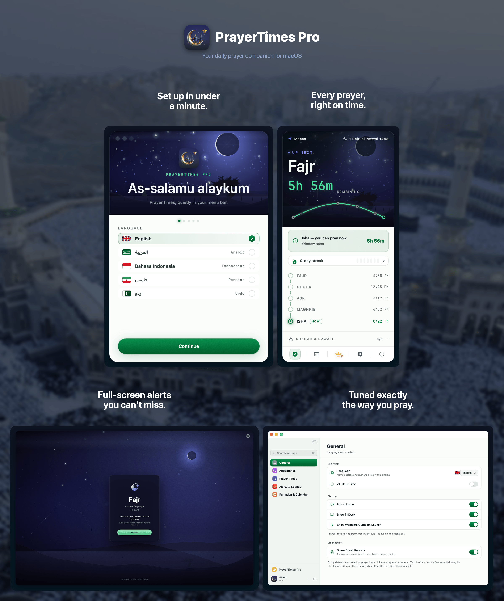

<p align="center">
    <strong>English</strong> | <a href="README.ar.md">العربية</a> | <a href="README.id.md">Indonesia</a> | <a href="README.fa.md">فارسی</a> | <a href="README.ur.md">اردو</a>
</p>

<p align="center">
    
</p>

<h1 align="center">PrayerTimes Pro</h1>

<p align="center">
    <strong>A minimalist, privacy-first Islamic prayer times app for your Mac's menu bar.</strong><br>
    Offline prayer-time calculation · 18+ methods · 5 languages · Apple Silicon & Intel
</p>

<p align="center">
    <a href="https://apps.apple.com/eg/app/prayer-times-pro-menubar/id6763390896?mt=12">
        
    </a>
</p>

<p align="center">
    <a href="https://github.com/App-Builders-Gang/PrayerTimes/releases/latest"></a>
    <a href="https://github.com/App-Builders-Gang/PrayerTimes/releases/latest"></a>
    <a href="https://github.com/App-Builders-Gang/PrayerTimes/releases"></a>
    <a href="https://github.com/App-Builders-Gang/PrayerTimes/issues"></a>
    <a href="https://github.com/App-Builders-Gang/PrayerTimes/stargazers"></a>
</p>

<p align="center">
    
    
    
    
</p>

<p align="center">
    
</p>

---

## Why PrayerTimes Pro?

- **Completely private** — no tracking, no analytics, no accounts. Prayer times are calculated on your Mac, and your precise location is never transmitted.
- **Designed for the menu bar** — always visible, never in the way. Countdown, exact time, compact, or icon-only.
- **Accurate worldwide** — 18+ calculation methods, per-prayer adjustments, custom angles.
- **Offline-first** — calculations happen on-device. Network is only used for optional location search.

## Install

**Requirements:** macOS 13 (Ventura) or later · Apple Silicon & Intel

### Mac App Store (recommended)

<a href="https://apps.apple.com/eg/app/prayer-times-pro-menubar/id6763390896?mt=12">
    
</a>

### Homebrew

```sh
brew install --cask app-builders-gang/tap/prayertimes
```

### Direct download

Download the latest `.dmg` from [Releases](https://github.com/App-Builders-Gang/PrayerTimes/releases/latest). The Developer ID build is signed, notarized, and auto-updates via [Sparkle](https://sparkle-project.org).

If macOS blocks the first launch:

```sh
xattr -r -d com.apple.quarantine /Applications/PrayerTimes.app
```

## Features

- Menu bar **countdown**, exact time, compact, or icon-only display
- **Notifications** before and at prayer time, with optional full-screen alerts
- **18+ calculation methods**: Muslim World League (MWL), ISNA, Egyptian General Authority, Umm al-Qura (Makkah), Diyanet (Turkey), Kemenag (Indonesia), Karachi, Tehran, Dubai, Qatar, Singapore, Kuwait, Algeria, France, Germany, Malaysia (JAKIM), and more
- **Auto or manual location** · per-prayer time adjustments to match your local mosque
- **Hijri calendar** with adjustable date and Islamic event notifications (Ramadan, Eid al-Fitr, Eid al-Adha, Islamic New Year, Day of Ashura, and more)
- **Ramadan mode**: Suhoor and Iftar notifications with pre-alerts
- **Locale-aware numerals** (Arabic-Indic, Extended Arabic-Indic, Western)
- **5 languages**: English, العربية, Bahasa Indonesia, فارسی, اردو — with full RTL support
- **Light/dark mode** follows your system

## Privacy

No tracking. No analytics. No crash reporters. No advertising. No accounts. Prayer times are calculated entirely on your Mac, and your **precise** location is never transmitted.

To show a city name rather than raw coordinates, the app rounds your position to ~1.1 km and asks Apple's geocoder for a name. Sending that coarsened coordinate to **OpenStreetMap Nominatim** instead — which Indonesian, Persian and Urdu need for a correctly-written name — is **off by default** and opt-in under Settings → Calculation & Location. Typing a city into the location picker sends the text you typed. Pro adhan clips download on demand from the Internet Archive, and Sparkle update checks run in the Developer ID build only. The Mac App Store build receives updates exclusively through Apple.

## What you can do here

- 🐛 [**Issues**](https://github.com/App-Builders-Gang/PrayerTimes/issues) — report a bug or request a feature, or [create a new one](https://github.com/App-Builders-Gang/PrayerTimes/issues/new/choose).
- 💬 [**Discussions**](https://github.com/App-Builders-Gang/PrayerTimes/discussions) — ask questions, share ideas, and chat with other users.
- 📥 [**Releases**](https://github.com/App-Builders-Gang/PrayerTimes/releases) — download a specific version or read the changelog.
- 📚 [**Wiki**](https://github.com/App-Builders-Gang/PrayerTimes/wiki) — guides, FAQ, and shared knowledge.

If you have a problem or a request, search [Issues](https://github.com/App-Builders-Gang/PrayerTimes/issues) first, then [open a new one](https://github.com/App-Builders-Gang/PrayerTimes/issues/new/choose). For general chat that doesn't fit as an issue, head to [Discussions](https://github.com/App-Builders-Gang/PrayerTimes/discussions).

## Support development

PrayerTimes Pro is built and maintained by one developer in their spare time. If it's useful to you, please consider supporting development:

<p>
    <a href="https://github.com/sponsors/abd3lraouf"></a>
    <a href="https://www.buymeacoffee.com/abd3lraouf"></a>
    <a href="https://ko-fi.com/abd3lraouf"></a>
</p>

Every contribution — no matter how small — helps keep the app actively developed and free of ads, trackers, and accounts.

## Credits

Built on top of these excellent projects:

- [Adhan](https://github.com/batoulapps/Adhan) — prayer time calculation
- [FluidMenuBarExtra](https://github.com/lfroms/fluid-menu-bar-extra) — menu bar UI
- [NavigationStack](https://github.com/indieSoftware/NavigationStack) — navigation
- [Sparkle](https://sparkle-project.org) — auto-update framework (Developer ID build)
- Inspired by [Sajda](https://github.com/ikoshura/Sajda)

## License

PrayerTimes Pro is **closed source**. This repository hosts the public release artifacts, issues, and discussions only. The application is distributed under its own End User License Agreement — see the [Mac App Store listing](https://apps.apple.com/eg/app/prayer-times-pro-menubar/id6763390896?mt=12).
