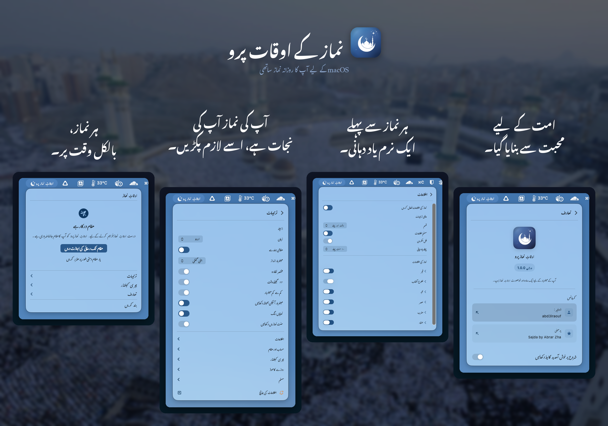

<p align="center">
    <a href="README.md">English</a> | <a href="README.ar.md">العربية</a> | <a href="README.id.md">Indonesia</a> | <a href="README.fa.md">فارسی</a> | <strong>اردو</strong>
</p>

<p align="center">
    
</p>

<h1 align="center">نماز کے اوقات پرو</h1>

<p align="center">
    <strong>آپ کے میک کے مینو بار میں رہنے والی ایک سادہ، رازداری کو اولیت دینے والی اسلامی نماز کے اوقات کی ایپ۔</strong><br>
    نماز کے اوقات کا آف لائن حساب · 18+ طریقے · 5 زبانیں · Apple Silicon اور Intel
</p>

<p align="center">
    <a href="https://apps.apple.com/eg/app/prayer-times-pro-menubar/id6763390896?mt=12">
        
    </a>
</p>

<p align="center">
    <a href="https://github.com/abd3lraouf-studios/PrayerTimes/releases/latest"></a>
    <a href="https://github.com/abd3lraouf-studios/PrayerTimes/releases/latest"></a>
    <a href="https://github.com/abd3lraouf-studios/PrayerTimes/releases"></a>
    <a href="https://github.com/abd3lraouf-studios/PrayerTimes/issues"></a>
    <a href="https://github.com/abd3lraouf-studios/PrayerTimes/stargazers"></a>
</p>

<p align="center">
    
    
    
    
</p>

<p align="center">
    
</p>

---

## نماز کے اوقات پرو ہی کیوں؟

- **مکمل طور پر نجی** — کوئی ٹریکنگ نہیں، کوئی تجزیات نہیں، کوئی اکاؤنٹ نہیں۔ نماز کے اوقات آپ کے میک پر شمار ہوتے ہیں، اور آپ کا درست مقام کبھی نہیں بھیجا جاتا۔
- **مینو بار کے لیے ڈیزائن** — ہمیشہ نظر میں، کبھی راستے میں نہیں۔ کاؤنٹ ڈاؤن، صحیح وقت، مختصر، یا صرف آئیکن۔
- **دنیا بھر میں درست** — 18+ حساب کے طریقے، فی نماز ایڈجسٹمنٹس، حسبِ ضرورت زاویے۔
- **آف لائن-فرسٹ** — حسابات آپ کے ڈیوائس پر ہوتے ہیں۔ نیٹ ورک صرف اختیاری مقام تلاش کے لیے استعمال ہوتا ہے۔

## انسٹالیشن

**ضروریات:** macOS 13 (Ventura) یا اس سے نیا · Apple Silicon اور Intel

### Mac App Store (تجویز کردہ)

<a href="https://apps.apple.com/eg/app/prayer-times-pro-menubar/id6763390896?mt=12">
    
</a>

### Homebrew

```sh
brew install --cask abd3lraouf-studios/tap/prayertimes
```

### براہِ راست ڈاؤن لوڈ

تازہ ترین `.dmg` فائل [Releases](https://github.com/abd3lraouf-studios/PrayerTimes/releases/latest) سے ڈاؤن لوڈ کریں۔ Developer ID والا بلڈ سائن شدہ، ایپل سے توثیق شدہ، اور [Sparkle](https://sparkle-project.org) کے ذریعے خودکار طور پر اپڈیٹ ہوتا ہے۔

اگر macOS پہلی بار چلانے سے روکے:

```sh
xattr -r -d com.apple.quarantine /Applications/PrayerTimes.app
```

## خصوصیات

- مینو بار میں **کاؤنٹ ڈاؤن**، صحیح وقت، مختصر، یا صرف آئیکن
- نماز سے پہلے اور نماز کے وقت **اطلاعات**، اختیاری فل اسکرین الرٹس کے ساتھ
- **18+ حساب کے طریقے**: مسلم ورلڈ لیگ (MWL)، ISNA، مصری جنرل اتھارٹی، ام القری (مکہ)، دیانیت (ترکی)، کیمیناگ (انڈونیشیا)، کراچی، تہران، دبئی، قطر، سنگاپور، کویت، الجزائر، فرانس، جرمنی، ملائیشیا (JAKIM)، اور مزید
- **خودکار یا دستی مقام** · مقامی مسجد سے مماثلت کے لیے فی نماز وقت کی ایڈجسٹمنٹ
- **ہجری کیلنڈر** قابل ایڈجسٹ تاریخ اور اسلامی واقعات کی اطلاعات کے ساتھ (رمضان، عید الفطر، عید الاضحیٰ، اسلامی نیا سال، یوم عاشورا، اور مزید)
- **رمضان موڈ**: سحری اور افطار کی اطلاعات پری-الرٹس کے ساتھ
- **مقام کے مطابق ہندسے** (عربی-ہندی، توسیع شدہ عربی-ہندی، مغربی)
- **5 زبانیں**: English، العربية، Bahasa Indonesia، فارسی، اردو — مکمل RTL سپورٹ کے ساتھ
- **روشن/گہرا موڈ** آپ کے سسٹم کے مطابق

## رازداری

کوئی ٹریکنگ نہیں۔ کوئی تجزیات نہیں۔ کوئی کریش رپورٹر نہیں۔ کوئی اشتہارات نہیں۔ کوئی اکاؤنٹ نہیں۔ نماز کے اوقات مکمل طور پر آپ کے میک پر شمار ہوتے ہیں، اور آپ کا **درست** مقام کبھی نہیں بھیجا جاتا۔

خام کوآرڈینیٹس کے بجائے شہر کا نام دکھانے کے لیے ایپ آپ کی پوزیشن کو ~1.1 کلومیٹر تک گول کر کے Apple کے جیو کوڈر سے نام مانگتی ہے۔ اسی گول کیے گئے کوآرڈینیٹ کو **OpenStreetMap Nominatim** کو بھیجنا — جس کی ضرورت انڈونیشی، فارسی اور اردو کو درست املا والے نام کے لیے ہوتی ہے — **بطورِ طے شدہ بند ہے** اور ترتیبات ← حساب اور مقام سے فعال کیا جا سکتا ہے۔ مقام منتخب کرنے والے میں شہر لکھتے وقت صرف وہی متن بھیجا جاتا ہے جو آپ لکھتے ہیں۔ پرو اذان کلپس ضرورت کے مطابق Internet Archive سے ڈاؤن لوڈ ہوتے ہیں، اور Sparkle اپڈیٹ چیک صرف Developer ID بلڈ میں چلتا ہے۔ Mac App Store بلڈ کو اپڈیٹس صرف ایپل سے ملتی ہیں۔

## یہاں آپ کیا کر سکتے ہیں

- 🐛 [**Issues**](https://github.com/abd3lraouf-studios/PrayerTimes/issues) — بگ رپورٹ کریں یا فیچر کی درخواست کریں، یا [نیا بنائیں](https://github.com/abd3lraouf-studios/PrayerTimes/issues/new/choose)۔
- 💬 [**Discussions**](https://github.com/abd3lraouf-studios/PrayerTimes/discussions) — سوالات پوچھیں، خیالات کا اشتراک کریں، اور دیگر صارفین سے بات چیت کریں۔
- 📥 [**Releases**](https://github.com/abd3lraouf-studios/PrayerTimes/releases) — کوئی مخصوص ورژن ڈاؤن لوڈ کریں یا تبدیلیوں کی فہرست دیکھیں۔
- 📚 [**Wiki**](https://github.com/abd3lraouf-studios/PrayerTimes/wiki) — گائیڈز، اکثر پوچھے گئے سوالات، اور مشترکہ معلومات۔

اگر آپ کو مسئلہ ہو یا درخواست ہو، پہلے [Issues](https://github.com/abd3lraouf-studios/PrayerTimes/issues) میں تلاش کریں، پھر [نیا کھولیں](https://github.com/abd3lraouf-studios/PrayerTimes/issues/new/choose)۔ عمومی بات چیت کے لیے [Discussions](https://github.com/abd3lraouf-studios/PrayerTimes/discussions) پر جائیں۔

## ترقی کی حمایت کریں

نماز کے اوقات پرو کو ایک ڈویلپر اپنے فارغ وقت میں بناتا اور برقرار رکھتا ہے۔ اگر یہ آپ کے لیے مفید ہے تو براہِ کرم ترقی کی حمایت کرنے پر غور کریں:

<p>
    <a href="https://github.com/sponsors/abd3lraouf"></a>
    <a href="https://www.buymeacoffee.com/abd3lraouf"></a>
    <a href="https://ko-fi.com/abd3lraouf"></a>
</p>

ہر تعاون — چاہے کتنا ہی چھوٹا ہو — ایپ کو فعال طور پر ترقی پذیر اور اشتہارات، ٹریکرز اور اکاؤنٹس سے پاک رکھنے میں مدد دیتا ہے۔

## شکریہ

ان شاندار منصوبوں پر بنایا گیا:

- [Adhan](https://github.com/batoulapps/Adhan) — نماز کے اوقات کا حساب
- [FluidMenuBarExtra](https://github.com/lfroms/fluid-menu-bar-extra) — مینو بار UI
- [NavigationStack](https://github.com/indieSoftware/NavigationStack) — نیویگیشن
- [Sparkle](https://sparkle-project.org) — خودکار اپڈیٹ فریم ورک (Developer ID بلڈ)
- [Sajda](https://github.com/ikoshura/Sajda) سے متاثر

## لائسنس

نماز کے اوقات پرو **بند سورس (closed source)** ہے۔ یہ ریپوزٹری صرف عوامی ریلیز آرٹیفیکٹس، Issues اور Discussions کی میزبانی کرتی ہے۔ ایپلیکیشن اپنے End User License Agreement کے تحت تقسیم کی جاتی ہے — [Mac App Store لسٹنگ](https://apps.apple.com/eg/app/prayer-times-pro-menubar/id6763390896?mt=12) دیکھیں۔
